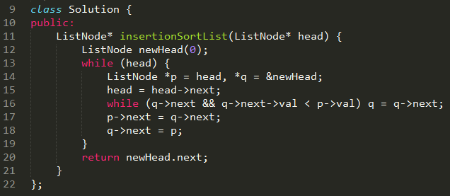
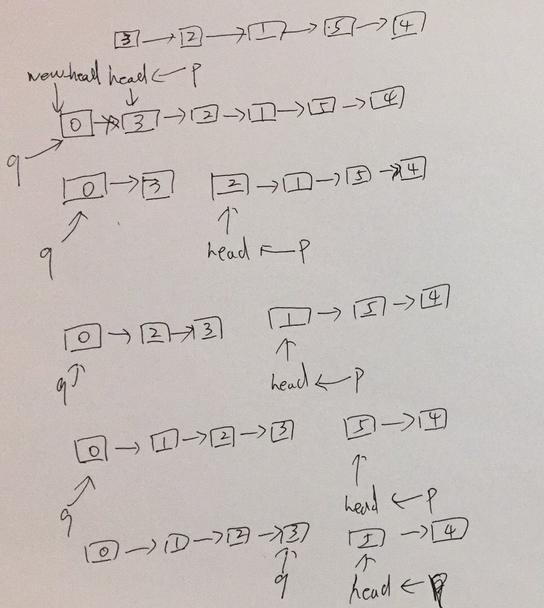

### 147. Insertion Sort List

Sort a linked list using insertion sort.

### 题目解析

本题要求用插入排序算法实现链表的排序。插入排序是一种简单直观的排序算法，它的工作原理是通过构建有序序列，对于未排序的数据，在已经
排序的序列从前向后扫描，找到对应的位置并插入。

本题的思路:
- 申请一个 new_head 节点，如果要从头部插入， new_head 可以提供便利
- 找到已经排序的序列中，大于未排序序列的第一个节点p的值的前驱节点q
- p.next 指向 q.next, q.next 指向 p

本次最优代码由 每日一题2群 的 @柳正来 提供

如下是 @柳正来 的解释

### 附录
附录是以上代码的图表分析

