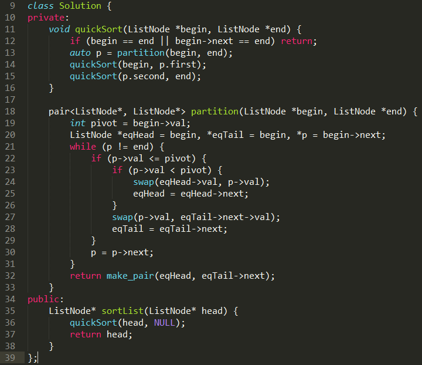

## 题目

148. Sort List

> Sort a linked list in O(n log n) time using constant space complexity.

https://leetcode.com/problems/sort-list/

## 题目解析

给输入的链表排序，要求

- 时间复杂度是O(n*logn)
- 空间复杂度是O(1)

## 解题思路

本题一共有二种解法

- 归并排序
- 快速排序

### 归并排序

#### 思路

归并排序的思想是分治算法，先分后合

- 将链表分成左右两个链表
- 分别给左右两个链表排序
- 将已经排序好的左右链表合并

> 需要注意的是，归并排序需要找到中间节点(mid)后, 先保存mid.next节点, 然后将mid.next 设置为null。这样做的目的是将左右链表分开。

@fzy 提供的Java代码:

### 快速排序

#### 思路

- 找出第一个节点 head 和最后一个节点 tail
- 以head为基准点，大于head节点的值放右边，小于head节点的值放左边
- 交换 head 与 pivot 节点，递归head, pivot 和  piovt, tail 排序

> 数组的快排: 先设立一个标杆值，然后用两个指针分别指向head, tail，head向右移动，tail 向左移动。
> 如果tail的值大于标杆的值(一般是第一个元素), head的值小于标杆的值就交换。

链表的快排的思路是这样的
- 定义两个指正: p, q. p 指向 head, q 指向 head.next
- 移动q, 当 q 的值小于标杆值value的时候停下来
  - 移动一次 p, 然后交换 p, q 的值
- 当q 等于tail的时候停止移动q 
- 交换 p 和 head 的值
- 返回 p 

返回的 p 就是我们要找的‘中心节点’， 它的左边的节点的值都小于它，右边节点的值都大于它。

@柳正来 提供的C++ 代码

