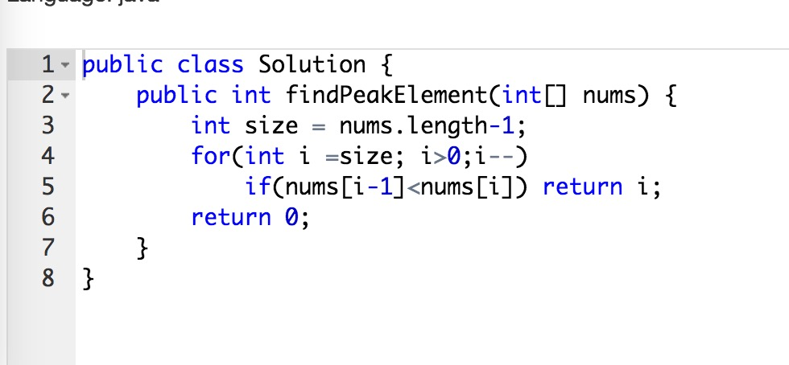
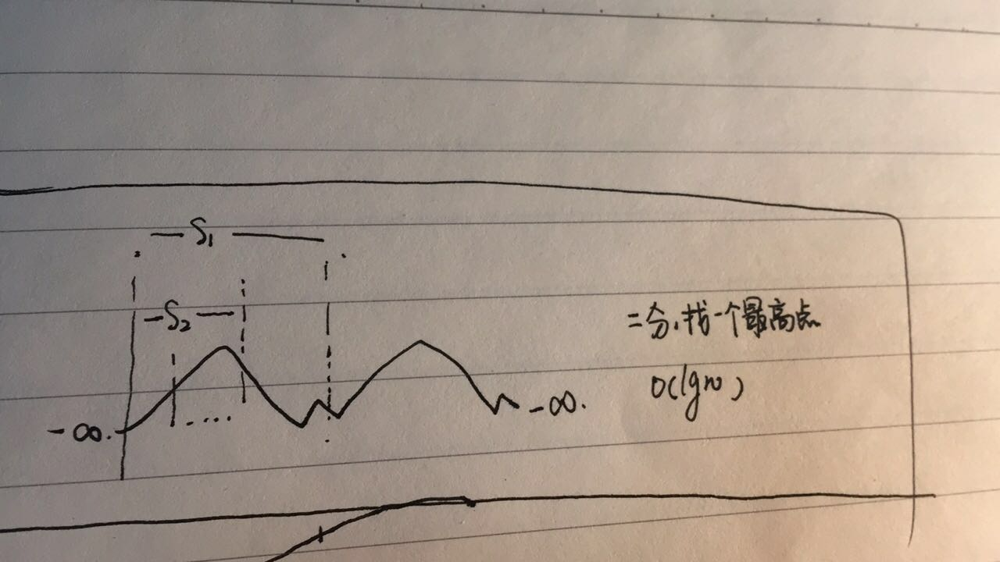
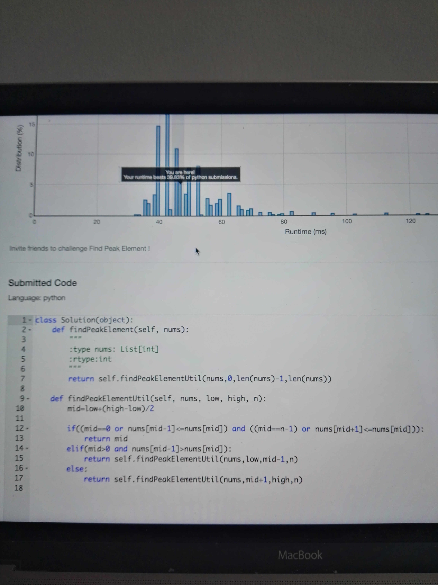
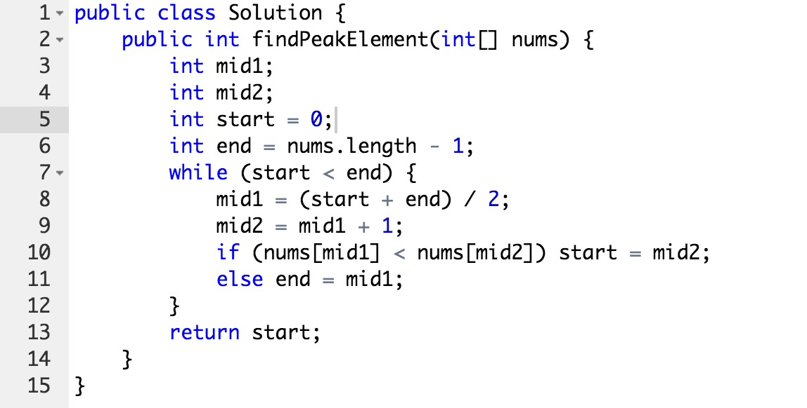
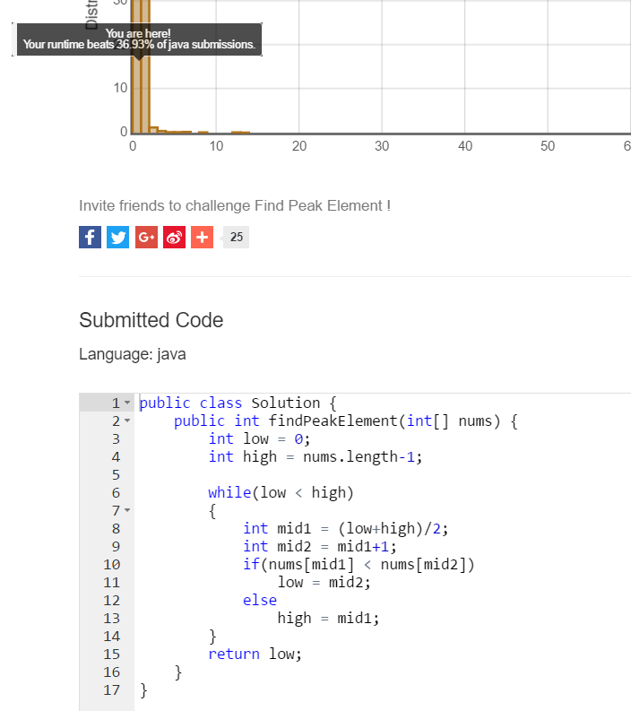
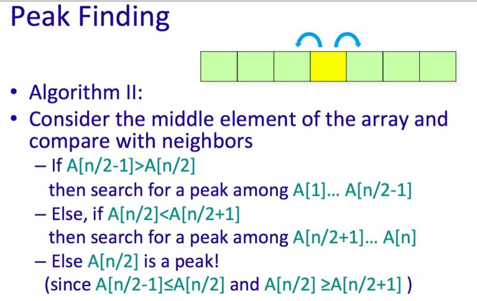
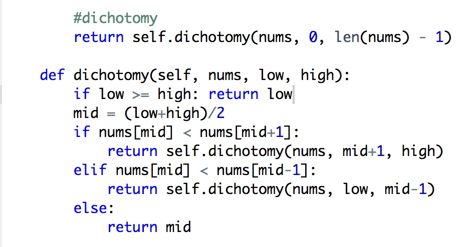
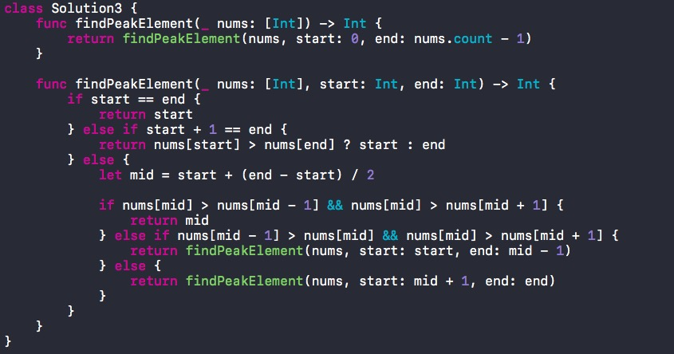

### 题目
Leetcode 第162题: Find Peak Element
https://leetcode.com/problems/find-peak-element/

描述如下：
> A peak element is an element that is greater than its neighbors.
>
> Given an input array where num[i] ≠ num[i+1], find a peak element and return its index.
>
> The array may contain multiple peaks, in that case return the index to any one of the peaks is fine.
>
> You may imagine that num[-1] = num[n] = -∞.
>
> For example, in array [1, 2, 3, 1], 3 is a peak element and your function should return the index number 2.
>
> click to show spoilers.
>
> Note:
> Your solution should be in logarithmic complexity.

Peak Element: 就是数组中的峰值的值，它大于它左边和右边。

### 解法概要
这道题的解法较多，大致可以分为：
- 暴力破解法
- 二分法

### 解法详细

#### 暴力法
> 从左到右扫描数组，判断i与i - 1 和 i + 1 的大小，如果满足要求则返回
> 暴力法的复杂度是 O(n) ，不符合题目对时间复杂度的要求，但是适合开拓思路，所以收录了。

@隽稚～俞霏的java实现
>思路是用 stack 容器存储index, 如果遇到比它指向的数小的就返回，如果第一个数最大，就遍历一遍以后在返回。
>使用这个方法，我们可以保证在栈顶的index表示的值一定是大于其栈底的index表示的值的。


@隽稚～俞霏的java实现：
> 思路同上，不同的是不用stack容器，而是用 peakIndex 来存储。


@有问题问寒哥 的 Python 实现
> 返回最大值, 最大值一定是峰值。


@有问题问寒哥 Python 实现


@Chirs C. 的 Java 实现
> 从小到大扫描数组：如果 nums[i] > nums[i-1] 则继续；如果 nums[i] < nums[i-1] 则返回 i - 1


@Jerrold_Gao 的 Java 实现
> 从大到小扫描数组：如果 nums[i] < nums[i-1] 则继续扫描；如果 nums[i] > nums[i-1] 则返回i



#### 二分法
> 通过猜测答案，不断缩小问题的区间。二分法是分治算法的典型应用。
> 二分法也可以转换成递归或者dfs


二分法适用氛围:
- 结果可预测: 比如问题的答案，最大是 n - 1, 最小是 0
- 结果的范围应该是离散的，不能是连续的
- 结果的氛围是递增或者递减的，不能是乱序的，比如本题的答案是 0 到 n-1, 是递增的


二分法的套路(伪代码):
```
 function binary_search(nums, left, right):
    return x if condition(left, right) # 终止条件

    mid = left + (right - left)/2
    while left < right
      if adjustment?(nums, left, right)
        left = mid + 1
      else
        right = mid

    return left
```


说明
- `adjustment` 是判断函数，来决定下一个取值区间
- `mid = left + (right - left)/2`也可以写成 `mid = (left + right)/2`, 但这种赋值方式有可能内存溢出，动态语言(ruby,python等)不需要考虑这个问题，编译型语言需要考虑int/float的最大值的情况加1导致的内存溢出。

二分法需要注意的问题:
- 二分法的区间需要: 开区间和闭区间
- 关键是写好判断函数, 判断函数可以使用贪心，动态规划等方法

@Sunny 对本题的解释挺好的, 也证明了为什么本题适应二分法
> 二分法的时候，不断的去较大值的区间，总是能找到峰值的。最坏的情况是峰值是 0




@韩医徽Neo 的java实现
> 二分法的递归版本




@张拯宇Tom 的 Java 实现
> 使用的是开区间，返回的是 start, start 是有可能取到 end 的值的。


@Armey郑兆奇的 Java 实现


@Armey郑兆奇的的 Java 实现
> 相比于上一版本，代码更简单清晰了




@Chirs C. 的 Java 实现




@Cifer 的 Java实现


@D@vid 的 Ruby 实现
> 不断的二分结果，知道 left 等于 right 或者 left + 1 = right


@D@vid 摘抄的课件解释




@Dmtalent Ding 的 Python 实现




@Jerrold_Gao 的 Java 实现


@Kee 的 Swift 实现


