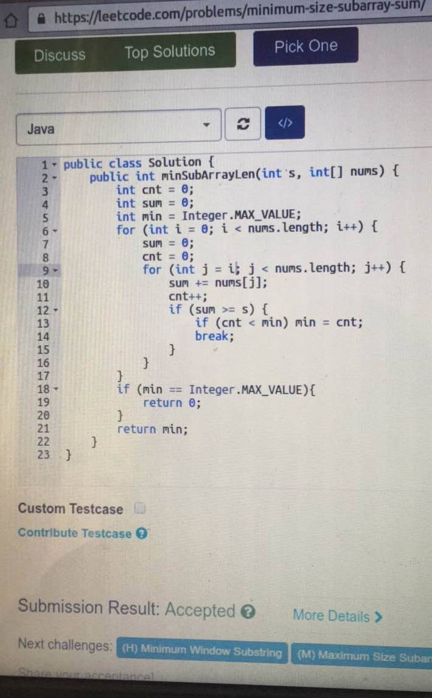
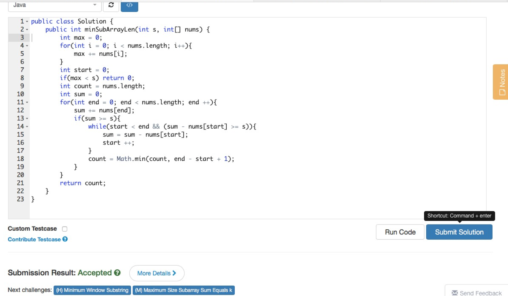
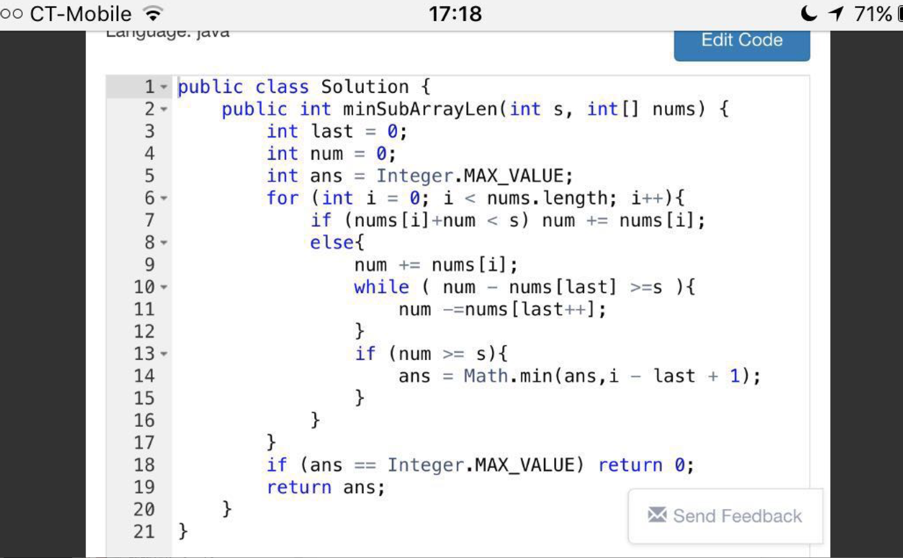
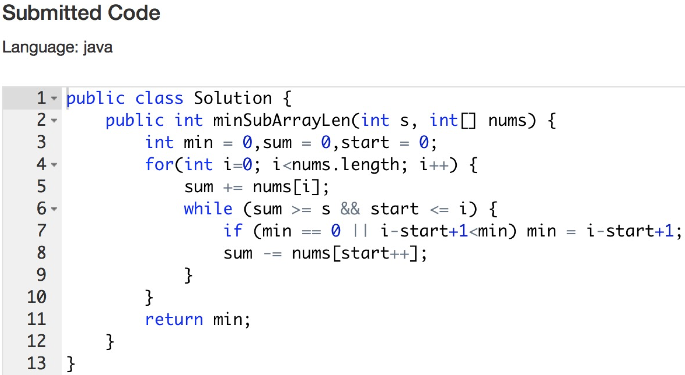
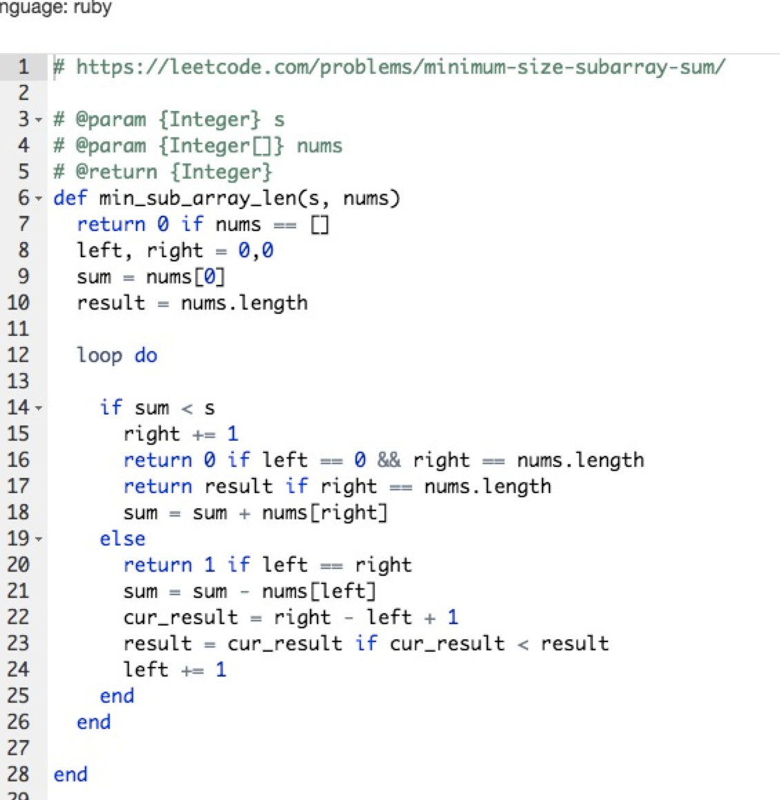
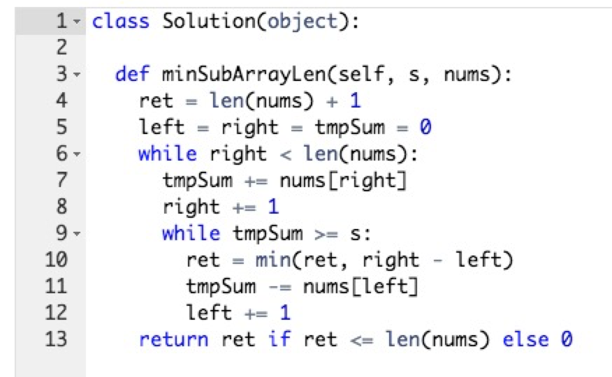
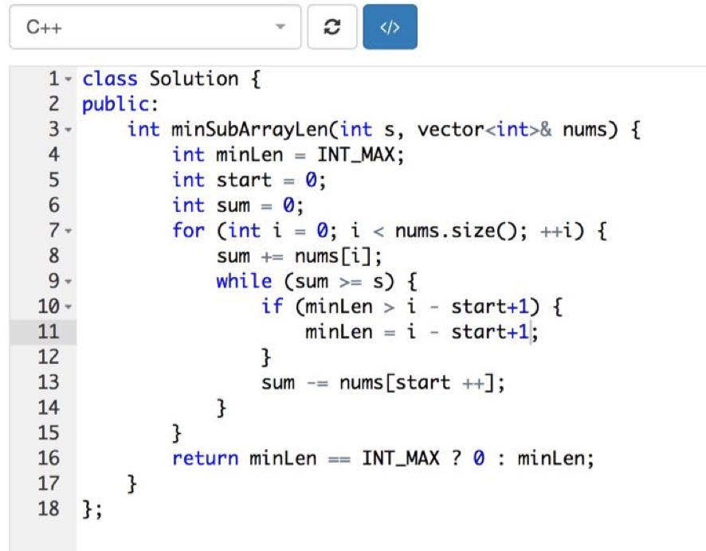
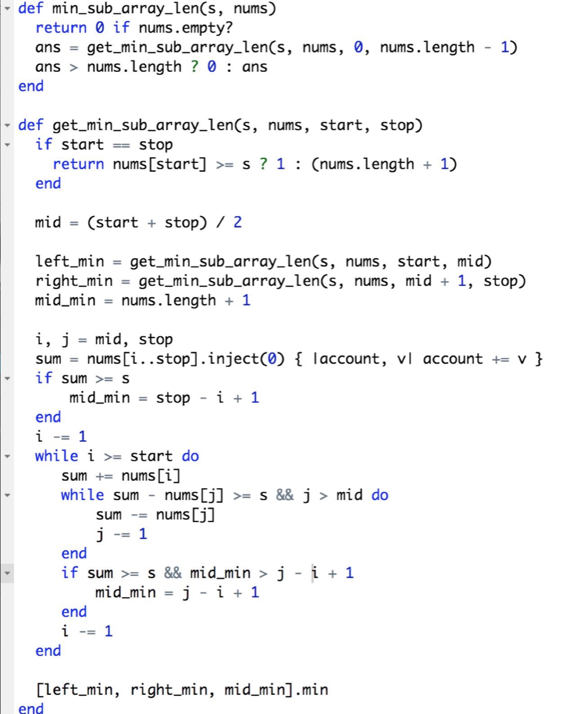
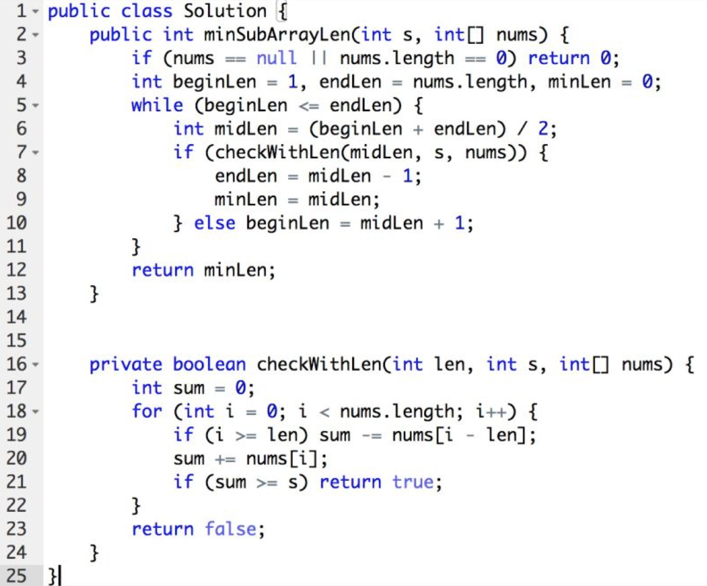
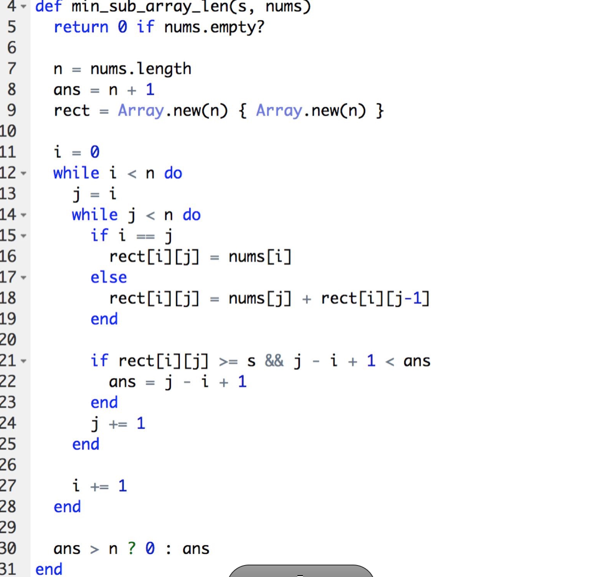

### 题目
这周的题目围绕Array展开。

今天（2017-02-02）选择的题目是LeetCode 209（https://leetcode.com/problems/minimum-size-subarray-sum/ ）

描述如下：
> Given an array of n positive integers and a positive integer s, find the minimal length of a contiguous subarray of which the sum ≥ s. If there isn't one, return 0 instead.
 
> For example, given the array [2,3,1,2,4,3] and s = 7,
the subarray [4,3] has the minimal length under the problem constraint.

### 解法概要
这道题的解法较多，大致可以分为：
- 暴力破解法
- Two Pointer
- 分治算法
- 二分法
- Queue＋贪心算法

### 解法详细

#### 暴力破解法

> 简要思路为，对输入的数组中的每一个元素，分别计算出能够满足s条件的最小的数组的长度。

具体实现代码可参考 @hz的java实现

 
#### Two Pointer
 > 简要思路为， 在输入的数组中，通过两个指针的移动来找出满足s条件的最小的数组的长度。
 
 
 @张拯宇Tom@_@ 的java实现：
     
 
 @岁的 java 实现
     
 
 @M.renard java实现
     
     
 @Jerrold_Gao java实现
      
 
 @david ruby实现
      
      
 @有问题问寒哥 的ruby实现
      
 
 @一元硬币的c++实现
       
       

#### 分治法
>简要思路为：如果结果在右边，求出右边的最小值；如果结果在左边，求出左边的最小值；如果结果在左边和右边，则求出包含mid的最小值

@东东 的实现

#### 二分法
@隽稚~俞霏 的实现
         
         
#### 队列＋贪心
@东东的实现

@TK的实现

