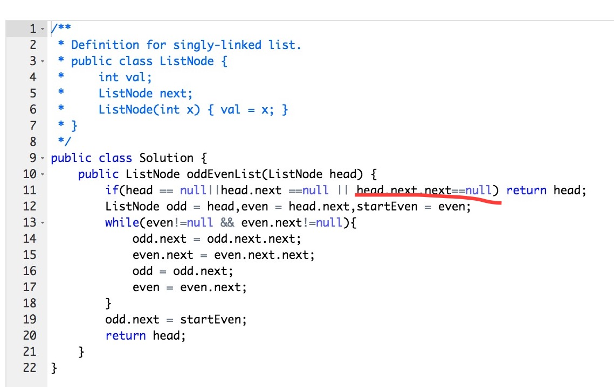
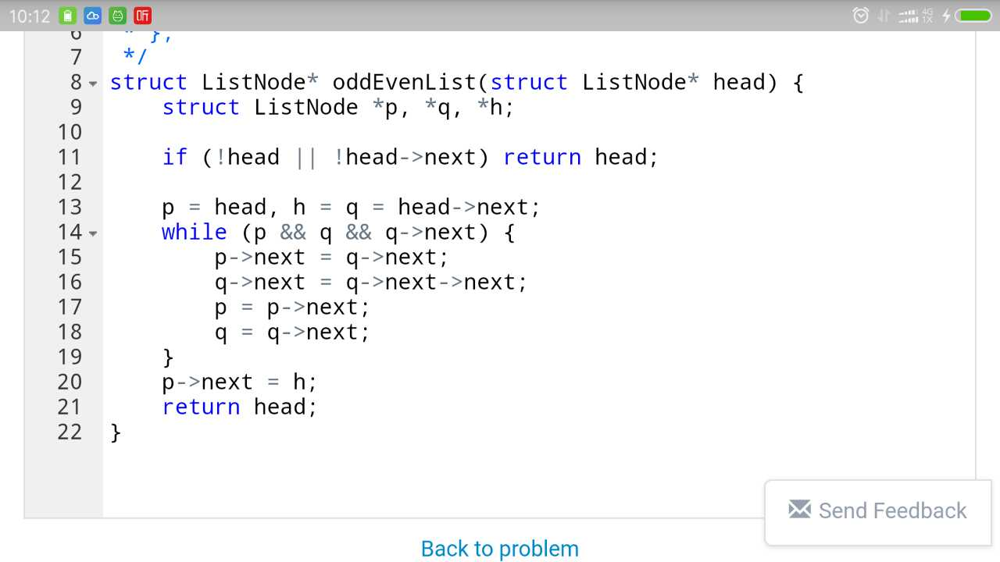
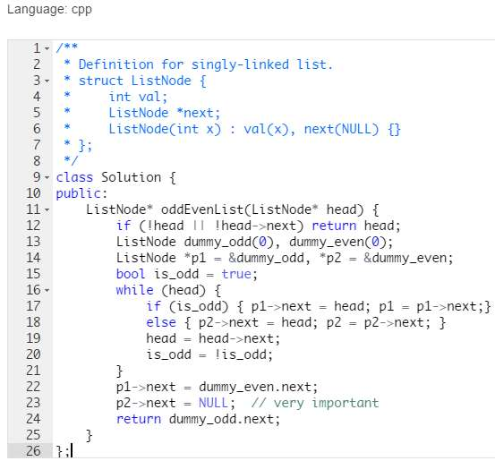
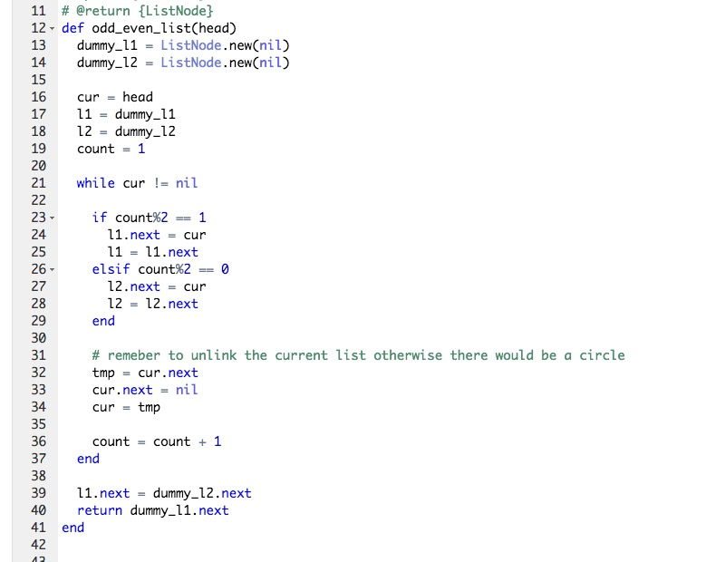
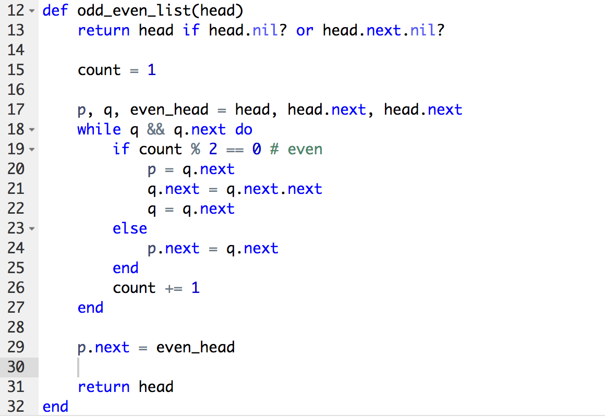
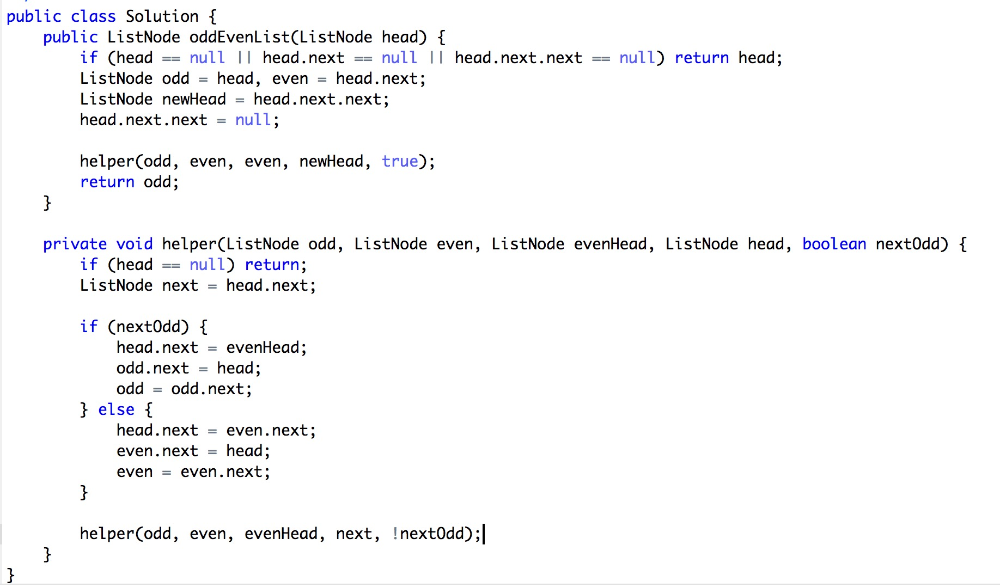

## 328. Odd Even Linked List

> Given a singly linked list, group all odd nodes together followed by the even nodes. Please note here we are talking about the node number and not the value in the nodes.
> 
> You should try to do it in place. The program should run in O(1) space complexity and O(nodes) time complexity.
> 
> Example:
> Given 1->2->3->4->5->NULL,
> return 1->3->5->2->4->NULL.
> 
> Note:
> The relative order inside both the even and odd groups should remain as it was in the input. 
> The first node is considered odd, the second node even and so on ...

## 题目解析

本题要求我们将奇数节点和偶数节点分开。链表的题目大部分是考察对‘指针’的灵活运用，本地也不例外。

本题一共有四种思路
- 类似双指针: 一个指针指向odd, 一个指针指向even, 循环访问所有的节点, 将奇数和偶数节点分开
- 用一个标志位来区分奇数和偶数指针
- 用当前节点的位置来区分奇数和偶数指针
- 结合标志位或者当前位置和深度优先搜索解题

本题的关键在于区分奇数和偶数节点，不同的节点类型处理方式也不一样。最好的方案是第一个方案，不需要用额外的空间来区分奇数和偶数指针。

## 答案

> 因为时间关系，本题只收录了部分提交

### 类似双指针方案
> 如何两个版本有点细微的差别

@Jerrold_Gao 提交的Java版本

@Cifer 提交的 C 版本

@黄xing 提交的 [java 版本](../../users/xing/328_Odd_Even_linklist.java) 

### 布尔类型的标志位

@TK 提交的 C++ 版本

### 当前节点的位置

@D@vid 提交的 Ruby 版本

@东东 提交的 Ruby 版本

### 深度优先搜索

@fzy 提交的 Java 版本

